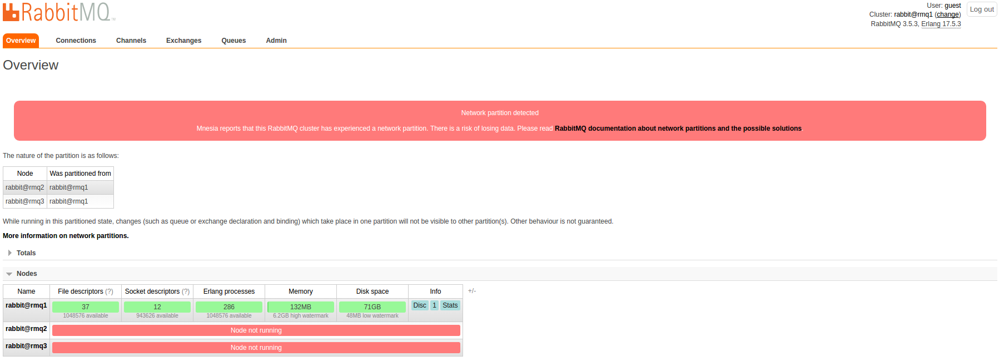

# Docker Rabbitmq HA Cluster

A docker stack to create, test and benchmark a rabbitmq cluster in high availability configuration:

| Tool        | Version |
| -------------: |:-----|
| RabbitMQ      | v3.6.5 |
| HAProxy      | v1.6.3 |
| PHP | v7.1 |
| Docker | v1.12+ |
| Docker-compose | v1.8+ |

* HAProxy as a load balancer
* N nodes cluster
* **Durable**, **Mirrored** and **Persistent** Exchanges, Queues and Messages
* HA custom policies
* Parallel producers and consumers
* **Node failures** and **network partition** experiment

If you have questions, comments or suggestions please just create issues.

## The architecture


 * **3 RabbitMQ nodes** but we can add a lot more.
 * **3 docker networks** to be able to simulate network partition.
 * **1 HAProxy node** to load balance request and to be "failure proof".
 * **1 default network** for the consumers and producers to connect with nodes through HAProxy.

## The stack

A lot of great tools (thanks to all awesome authors)

* Make
* Docker and docker-compose
* Rabbitmq and Management Plugin (docker)
* [HAProxy](https://github.com/docker/dockercloud-haproxy)
* Shell scripts
* Symfony MicroFramework (producers and consumers in docker containers)
* [swarrot](https://github.com/swarrot/swarrot) / [swarrot-bundle](https://github.com/swarrot/SwarrotBundle)
* [php-amqplib/rabbitmq-bundle](https://github.com/php-amqplib/RabbitMqBundle)
* [odolbeau/rabbit-mq-admin-toolkit](https://github.com/odolbeau/rabbit-mq-admin-toolkit)

## Tests / Benchmark

With this stack you will be able to experiment:

* Load Balancing
* Node failure
* Network partition
* Messages persistency
* Message NO ACK and retries

## Setup / Start / Stop the cluster

```shell
git clone git@github.com:ypereirareis/docker-rabbitmq-ha-cluster.git && cd docker-rabbitmq-ha-cluster
make install
make start
make stop
```

Once the setup process is over, check everything is ok (sometimes the startup process fails):

```
make stop && make start # To restart the cluster properly
```

```shell
$ make state
== Print state of containers ==
    Name                   Command               State                                                          Ports                                                         
-----------------------------------------------------------------------------------------------------------------------------------------------------------------------------
rmq_haproxy_1   /sbin/tini -- dockercloud- ...   Up      1936/tcp, 443/tcp, 0.0.0.0:5672->5672/tcp, 0.0.0.0:80->80/tcp                                                        
rmq_rmq1_1      /pre-entrypoint.sh rabbitm ...   Up      127.0.0.1:1234->15672/tcp, 25672/tcp, 4369/tcp, 5672/tcp, 9100/tcp, 9101/tcp, 9102/tcp, 9103/tcp, 9104/tcp, 9105/tcp 
rmq_rmq2_1      /pre-entrypoint.sh rabbitm ...   Up      127.0.0.1:1235->15672/tcp, 25672/tcp, 4369/tcp, 5672/tcp, 9100/tcp, 9101/tcp, 9102/tcp, 9103/tcp, 9104/tcp, 9105/tcp 
rmq_rmq3_1      /pre-entrypoint.sh rabbitm ...   Up      127.0.0.1:1236->15672/tcp, 25672/tcp, 4369/tcp, 5672/tcp, 9100/tcp, 9101/tcp, 9102/tcp, 9103/tcp, 9104/tcp, 9105/tcp
```


Access the Management Plugin interface for nodes:

* http://127.0.0.1:1234
* http://127.0.0.1:1235
* http://127.0.0.1:1236


You can use, test or compare two php/symfony librairies.
Simply use one of the library or both in the mean time.

### Swarrot/SwarrotBundle

[Read the documentation for Swarrot/SwarrotBundle](./doc/SWARROT.md)

### php-amqplib/RabbitMqBundle

[Read the documentation for php-amqplib/RabbitMqBundle](./doc/OLDSOUND.md)

## Tests/Benckmark

### Node failures

#### Stop the first node

```
$ make stop-node-1
== Stop rabbitmq node 1 from cluster ==
rmq_rmq1_1
```


#### Stop the second node

```
$ make stop-node-2 
== Stop rabbitmq node 2 from cluster ==
rmq_rmq2_1
```


#### Restart the first node

```
$ make resume-node-1
== Stop rabbitmq node 1 from cluster ==
rmq_rmq1_1
```


#### Restart all nodes

```
$ make start
== Start App ==
rmq_rmq1_1 is up-to-date
Starting rmq_rmq2_1
Starting rmq_rmq3_1
rmq_haproxy_1 is up-to-date
```


### Network partition


#### Exclude node 1 from the network cluster

```
$ make exclude-node-1
== Exclude rabbitmq node 1 from cluster ==
```

#### Restore node 1 in the network cluster

```
$ make restore-node-1 
== Exclude rabbit node 1 from cluster ==
```

**Partition between node 1 and node 2 and 3...**




**...but all nodes are still running**


[https://www.rabbitmq.com/partitions.html](https://www.rabbitmq.com/partitions.html)

## Big cluster

You can easily create a lot of nodes in your cluster.

```
make add-more-nodes
```


## TODO

* Tests

## Resources

* http://blog.eleven-labs.com/fr/publier-consommer-reessayer-des-messages-rabbitmq/
* https://odolbeau.fr/blog/benchmark-php-amqp-lib-amqp-extension-swarrot.html
* https://github.com/docker/dockercloud-haproxy
* https://github.com/bijukunjummen/docker-rabbitmq-cluster
* https://www.rabbitmq.com/ha.html
* https://www.rabbitmq.com/persistence-conf.html
* https://github.com/php-amqplib/RabbitMqBundle
* https://github.com/swarrot
* http://symfony.com/doc/current/configuration/micro_kernel_trait.html
* https://docs.docker.com/engine/userguide/networking/
* https://www.nginx.com/resources/admin-guide/tcp-load-balancing/
* https://github.com/alanxz/rabbitmq-c

## License

The MIT License (MIT)

Copyright (c) 2017 Yannick Pereira-Reis

Permission is hereby granted, free of charge, to any person obtaining a copy
of this software and associated documentation files (the "Software"), to deal
in the Software without restriction, including without limitation the rights
to use, copy, modify, merge, publish, distribute, sublicense, and/or sell
copies of the Software, and to permit persons to whom the Software is
furnished to do so, subject to the following conditions:

The above copyright notice and this permission notice shall be included in all
copies or substantial portions of the Software.

THE SOFTWARE IS PROVIDED "AS IS", WITHOUT WARRANTY OF ANY KIND, EXPRESS OR
IMPLIED, INCLUDING BUT NOT LIMITED TO THE WARRANTIES OF MERCHANTABILITY,
FITNESS FOR A PARTICULAR PURPOSE AND NONINFRINGEMENT. IN NO EVENT SHALL THE
AUTHORS OR COPYRIGHT HOLDERS BE LIABLE FOR ANY CLAIM, DAMAGES OR OTHER
LIABILITY, WHETHER IN AN ACTION OF CONTRACT, TORT OR OTHERWISE, ARISING FROM,
OUT OF OR IN CONNECTION WITH THE SOFTWARE OR THE USE OR OTHER DEALINGS IN THE
SOFTWARE.
