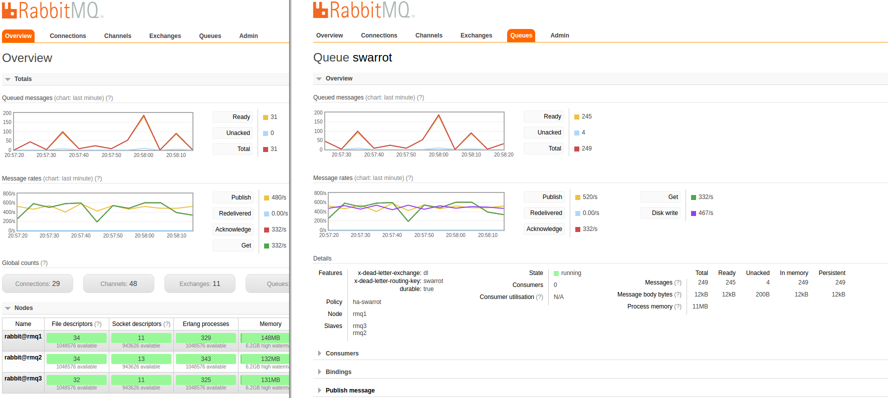
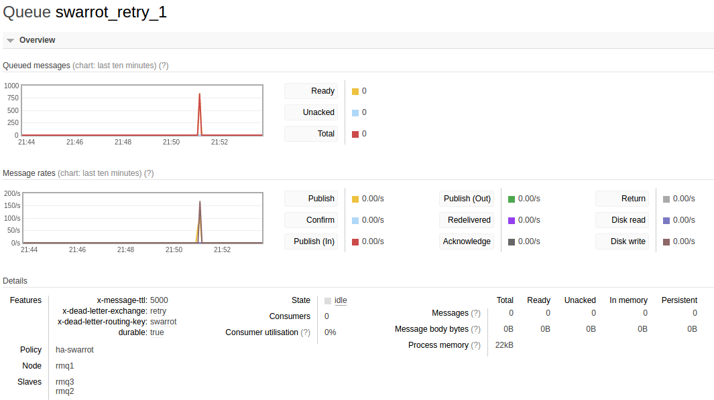
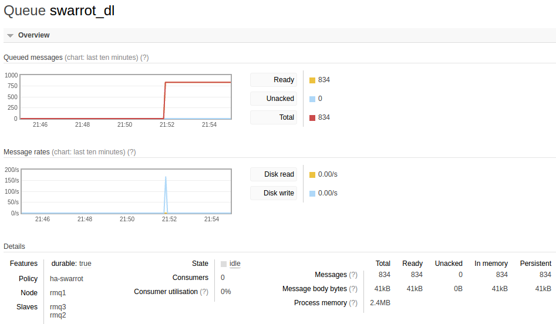
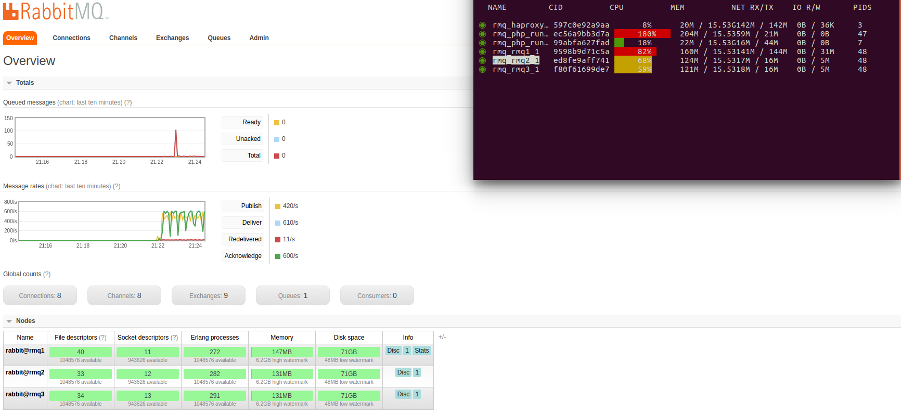

# Docker Rabbitmq HA Cluster

A docker stack to create, test and benchmark a rabbitmq cluster in high availability configuration:

| Tool        | Version |
| -------------: |:-----|
| RabbitMQ      | v3.6.5 |
| HAProxy      | v1.6.3 |
| PHP | v7.1 |
| Docker | v1.12+ |
| Docker-compose | v1.8+ |

* HAProxy as a load balancer
* N nodes cluster
* **Durable**, **Mirrored** and **Persistent** Exchanges, Queues and Messages
* HA custom policies
* Parallel producers and consumers
* **Node failures** and **network partition** experiment

If you have questions, comments or suggestions please just create issues.

## The architecture


 * **3 RabbitMQ nodes** but we can add a lot more.
 * **3 docker networks** to be able to simulate network partition.
 * **1 HAProxy node** to load balance request and to be "failure proof".
 * **1 default network** for the consumers and producers to connect with nodes through HAProxy.

## The stack

A lot of great tools (thanks to all awesome authors)

* Make
* Docker and docker-compose
* Rabbitmq and Management Plugin (docker)
* [HAProxy](https://github.com/docker/dockercloud-haproxy)
* Shell scripts
* Symfony MicroFramework (producers and consumers in docker containers)
* [swarrot](https://github.com/swarrot/swarrot) / [swarrot-bundle](https://github.com/swarrot/SwarrotBundle)
* [php-amqplib/rabbitmq-bundle](https://github.com/php-amqplib/RabbitMqBundle)
* [odolbeau/rabbit-mq-admin-toolkit](https://github.com/odolbeau/rabbit-mq-admin-toolkit)

## Tests / Benchmark

With this stack you will be able to experiment:

* Load Balancing
* Node failure
* Network partition
* Messages persistency
* Message NO ACK and retries

## Setup / Start /Stop the cluster

```shell
git clone git@github.com:ypereirareis/docker-rabbitmq-ha-cluster.git && cd docker-rabbitmq-ha-cluster
make install
make start
make stop
```

Once the setup process is over, check everything is ok (sometimes the startup process fails):

```
make stop && make start # To restart the cluster properly
```

```shell
$ make state
== Print state of containers ==
    Name                   Command               State                                                          Ports                                                         
-----------------------------------------------------------------------------------------------------------------------------------------------------------------------------
rmq_haproxy_1   /sbin/tini -- dockercloud- ...   Up      1936/tcp, 443/tcp, 0.0.0.0:5672->5672/tcp, 0.0.0.0:80->80/tcp                                                        
rmq_rmq1_1      /pre-entrypoint.sh rabbitm ...   Up      127.0.0.1:1234->15672/tcp, 25672/tcp, 4369/tcp, 5672/tcp, 9100/tcp, 9101/tcp, 9102/tcp, 9103/tcp, 9104/tcp, 9105/tcp 
rmq_rmq2_1      /pre-entrypoint.sh rabbitm ...   Up      127.0.0.1:1235->15672/tcp, 25672/tcp, 4369/tcp, 5672/tcp, 9100/tcp, 9101/tcp, 9102/tcp, 9103/tcp, 9104/tcp, 9105/tcp 
rmq_rmq3_1      /pre-entrypoint.sh rabbitm ...   Up      127.0.0.1:1236->15672/tcp, 25672/tcp, 4369/tcp, 5672/tcp, 9100/tcp, 9101/tcp, 9102/tcp, 9103/tcp, 9104/tcp, 9105/tcp
```


Access the Management Plugin interface for nodes:

* http://127.0.0.1:1234
* http://127.0.0.1:1235
* http://127.0.0.1:1236


You can use, test or compare two php/symfony librairies.
Simply use one of the library or both in the mean time.

### Swarrot/SwarrotBundle

Of course at this step, you must have followed the [startup instructions](#setup--start-stop-the-cluster).

Check this blog post: http://blog.eleven-labs.com/fr/publier-consommer-reessayer-des-messages-rabbitmq/

**With Swarrot we use a PULL/POLL strategy, consumers are not registered in RabbitMQ**

#### Set the ha-policy

```shell
$ make cluster-sw
== SWARROT Rabbit Clustering ==
Setting policy "ha-swarrot" for pattern "^swarrot" to " {\"ha-mode\":\"all\",\"ha-sync-mode\":\"automatic\"}" with priority "0" ...
```


#### Exchanges/Queues

With Swarrot, exchanges and queues are not created by the library or the bundle.
YOu need to create everything manually or with command line.

```shell
$ make init-sw
== Rabbit init ==
IMPORTANT : Waiting for nothing because no  env var defined !!!
With DL: false
With Unroutable: false
Create exchange swarrot
Create exchange dl
Create queue swarrot
Create queue swarrot_dl
Create binding between exchange dl and queue swarrot_dl (with routing_key: swarrot)
Create exchange retry
Create queue swarrot_retry_1
Create binding between exchange retry and queue swarrot_retry_1 (with routing_key: swarrot_retry_1)
Create binding between exchange retry and queue swarrot (with routing_key: swarrot)
Create exchange retry
Create queue swarrot_retry_2
Create binding between exchange retry and queue swarrot_retry_2 (with routing_key: swarrot_retry_2)
Create binding between exchange retry and queue swarrot (with routing_key: swarrot)
Create exchange retry
Create queue swarrot_retry_3
Create binding between exchange retry and queue swarrot_retry_3 (with routing_key: swarrot_retry_3)
Create binding between exchange retry and queue swarrot (with routing_key: swarrot)
Create binding between exchange swarrot and queue swarrot (with routing_key: swarrot)
```


#### Consumers

```shell
$ make bash
== Connect into PHP container ==
IMPORTANT : Waiting for nothing because no  env var defined !!!
bash-4.3# ./consume.sh 
---------------------------------------------------
> Type: swarrot
> Info: 30 consumers running in parallel reading 100 messages each before finishing
---------------------------------------------------
30 consumers running...
```

#### Producers

```shell
$ make bash
== Connect into PHP container ==
IMPORTANT : Waiting for nothing because no  env var defined !!!
bash-4.3# ./produce.sh 
---------------------------------------------------
> Type: swarrot
> Info: 10 producers running in parallel
---------------------------------------------------
10 producers running...
Process 10: 100 more messages added
Process 20: 100 more messages added
```

Once consumers and producers are started you should see messages in the Rabbitmq Management Plugin interface for all nodes.



#### Retry

You must use a specific middleware configuration:

```yml
middleware_stack:
    - configurator: swarrot.processor.exception_catcher
    - configurator: swarrot.processor.ack
    - configurator: swarrot.processor.retry
      extras:
        retry_exchange: 'retry'
        retry_attempts: 3
        retry_routing_key_pattern: 'swarrot_retry_%%attempt%%'
```

Then you need to throw an exception in the consumer (NO ACK):

```php
    public function process(Message $message, array $options)
    {
        throw new \Exception('NO ACK');
    }
```








### php-amqplib/RabbitMqBundle

Of course at this step, you must have followed the [startup instructions](#setup--start-stop-the-cluster).

**With RabbitMqBundle we use a PUSH strategy, consumers are registered in RabbitMQ**

> With the "push API", applications have to indicate interest in consuming messages from a particular queue. When they do so, we say that they register a consumer or, simply put, subscribe to a queue. It is possible to have more than one consumer per queue or to register an exclusive consumer (excludes all other consumers from the queue while it is consuming).

#### Set the ha-policy

```shell
$ make cluster-os
== SWARROT Rabbit Clustering ==
Setting policy "ha-oldsound" for pattern "^oldsound" to " {\"ha-mode\":\"all\",\"ha-sync-mode\":\"automatic\"}" with priority "0" ...
```


#### Consumers

```shell
$ make bash
== Connect into PHP container ==
IMPORTANT : Waiting for nothing because no  env var defined !!!
bash-4.3# ./consume.sh oldsound
---------------------------------------------------
> Type: oldsound
> Info: 30 consumers running in parallel reading 100 messages each before finishing
---------------------------------------------------
30 consumers running...
```


#### Producers

```shell
$ make bash
== Connect into PHP container ==
IMPORTANT : Waiting for nothing because no  env var defined !!!
bash-4.3# ./produce.sh oldsound
---------------------------------------------------
> Type: oldsound
> Info: 10 producers running in parallel
---------------------------------------------------
10 producers running...
Process 582: 100 more messages added
Process 591: 100 more messages added
```

Once consumers and producers are started you should see messages in the Rabbitmq Management Plugin interface for all nodes.


## Tests/Benckmark

### Node failures

#### Stop the first node

```
$ make stop-node-1
== Stop rabbitmq node 1 from cluster ==
rmq_rmq1_1
```


#### Stop the second node

```
$ make stop-node-2 
== Stop rabbitmq node 2 from cluster ==
rmq_rmq2_1
```


#### Restart the first node

```
$ make resume-node-1
== Stop rabbitmq node 1 from cluster ==
rmq_rmq1_1
```


#### Restart all nodes

```
$ make start
== Start App ==
rmq_rmq1_1 is up-to-date
Starting rmq_rmq2_1
Starting rmq_rmq3_1
rmq_haproxy_1 is up-to-date
```



### Network partition


#### Exclude node 1 from the network cluster

```
$ make exclude-node-1
== Exclude rabbitmq node 1 from cluster ==
```

#### Restore node 1 in the network cluster

```
$ make restore-node-1 
== Exclude rabbit node 1 from cluster ==
```

**Partition between node 1 and node 2 and 3...**


**...but all nodes are still running**


[https://www.rabbitmq.com/partitions.html](https://www.rabbitmq.com/partitions.html)

## Big cluster

You can easily create a lot of nodes in your cluster.

```
make add-more-nodes
```


## TODO

* Tests

## Resources

* http://blog.eleven-labs.com/fr/publier-consommer-reessayer-des-messages-rabbitmq/
* https://odolbeau.fr/blog/benchmark-php-amqp-lib-amqp-extension-swarrot.html
* https://github.com/docker/dockercloud-haproxy
* https://github.com/bijukunjummen/docker-rabbitmq-cluster
* https://www.rabbitmq.com/ha.html
* https://www.rabbitmq.com/persistence-conf.html
* https://github.com/php-amqplib/RabbitMqBundle
* https://github.com/swarrot
* http://symfony.com/doc/current/configuration/micro_kernel_trait.html
* https://docs.docker.com/engine/userguide/networking/
* https://www.nginx.com/resources/admin-guide/tcp-load-balancing/
* https://github.com/alanxz/rabbitmq-c

## License

The MIT License (MIT)

Copyright (c) 2017 Yannick Pereira-Reis

Permission is hereby granted, free of charge, to any person obtaining a copy
of this software and associated documentation files (the "Software"), to deal
in the Software without restriction, including without limitation the rights
to use, copy, modify, merge, publish, distribute, sublicense, and/or sell
copies of the Software, and to permit persons to whom the Software is
furnished to do so, subject to the following conditions:

The above copyright notice and this permission notice shall be included in all
copies or substantial portions of the Software.

THE SOFTWARE IS PROVIDED "AS IS", WITHOUT WARRANTY OF ANY KIND, EXPRESS OR
IMPLIED, INCLUDING BUT NOT LIMITED TO THE WARRANTIES OF MERCHANTABILITY,
FITNESS FOR A PARTICULAR PURPOSE AND NONINFRINGEMENT. IN NO EVENT SHALL THE
AUTHORS OR COPYRIGHT HOLDERS BE LIABLE FOR ANY CLAIM, DAMAGES OR OTHER
LIABILITY, WHETHER IN AN ACTION OF CONTRACT, TORT OR OTHERWISE, ARISING FROM,
OUT OF OR IN CONNECTION WITH THE SOFTWARE OR THE USE OR OTHER DEALINGS IN THE
SOFTWARE.
