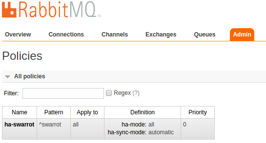
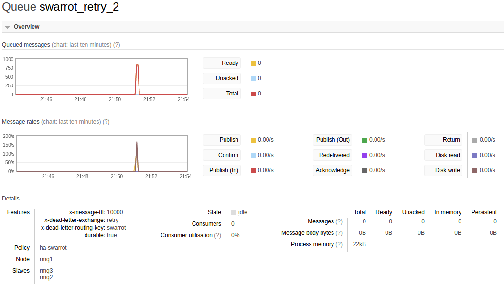

# Swarrot/SwarrotBundle

* Of course at this step, you must have followed the [startup instructions](https://github.com/ypereirareis/docker-rabbitmq-ha-cluster/tree/refacto-doc#setup--start--stop-the-cluster).
* Check this blog post: http://blog.eleven-labs.com/fr/publier-consommer-reessayer-des-messages-rabbitmq/
* **With Swarrot we use a PULL/POLL strategy, consumers are not registered in RabbitMQ**

## Set the ha-policy

```shell
$ make cluster-sw
== SWARROT Rabbit Clustering ==
Setting policy "ha-swarrot" for pattern "^swarrot" to " {\"ha-mode\":\"all\",\"ha-sync-mode\":\"automatic\"}" with priority "0" ...
```



## Exchanges/Queues

With Swarrot, exchanges and queues are not created by the library or the bundle.
YOu need to create everything manually or with command line.

```shell
$ make init-sw
== Rabbit init ==
IMPORTANT : Waiting for nothing because no  env var defined !!!
With DL: false
With Unroutable: false
Create exchange swarrot
Create exchange dl
Create queue swarrot
Create queue swarrot_dl
Create binding between exchange dl and queue swarrot_dl (with routing_key: swarrot)
Create exchange retry
Create queue swarrot_retry_1
Create binding between exchange retry and queue swarrot_retry_1 (with routing_key: swarrot_retry_1)
Create binding between exchange retry and queue swarrot (with routing_key: swarrot)
Create exchange retry
Create queue swarrot_retry_2
Create binding between exchange retry and queue swarrot_retry_2 (with routing_key: swarrot_retry_2)
Create binding between exchange retry and queue swarrot (with routing_key: swarrot)
Create exchange retry
Create queue swarrot_retry_3
Create binding between exchange retry and queue swarrot_retry_3 (with routing_key: swarrot_retry_3)
Create binding between exchange retry and queue swarrot (with routing_key: swarrot)
Create binding between exchange swarrot and queue swarrot (with routing_key: swarrot)
```


## Consumers

```shell
$ make bash
== Connect into PHP container ==
IMPORTANT : Waiting for nothing because no  env var defined !!!
bash-4.3# ./consume.sh 
---------------------------------------------------
> Type: swarrot
> Info: 30 consumers running in parallel reading 100 messages each before finishing
---------------------------------------------------
30 consumers running...
```

## Producers

```shell
$ make bash
== Connect into PHP container ==
IMPORTANT : Waiting for nothing because no  env var defined !!!
bash-4.3# ./produce.sh 
---------------------------------------------------
> Type: swarrot
> Info: 10 producers running in parallel
---------------------------------------------------
10 producers running...
Process 10: 100 more messages added
Process 20: 100 more messages added
```

Once consumers and producers are started you should see messages in the Rabbitmq Management Plugin interface for all nodes.


## Retry

You must use a specific middleware configuration:

```yml
middleware_stack:
    - configurator: swarrot.processor.exception_catcher
    - configurator: swarrot.processor.ack
    - configurator: swarrot.processor.retry
      extras:
        retry_exchange: 'retry'
        retry_attempts: 3
        retry_routing_key_pattern: 'swarrot_retry_%%attempt%%'
```

Then you need to throw an exception in the consumer (NO ACK):

```php
    public function process(Message $message, array $options)
    {
        throw new \Exception('NO ACK');
    }
```





[Go to Index](../README.md)
